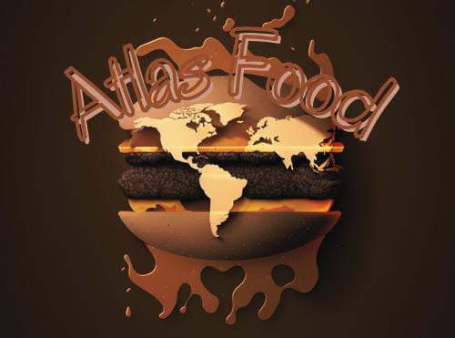

------

# 1. **Problema de Negócio**

## **1.1 Problema**

A empresa AtlasFood é uma marketplace de restaurantes. Ou seja, seu core business é facilitar o encontro e negociações de clientes e restaurantes. Os restaurantes fazem o cadastro dentro da plataforma da AtlasFood, que disponibiliza informações como endereço, tipo de culinária servida, se possui reservas, se faz entregas e também uma nota de avaliação dos serviços e produtos do restaurante, dentre outras informações

## **1.2 Objetivo**

Este projeto de insights tem o objetivo de fornecer um dashboard ao novo CEO que foi recém-contratado e precisa entender melhor o negócio para que assim consiga tomar as melhores decisões estratégicas.

# **2. Premissas do Negócio**

1. O modelo de negócio assumido é um Marketplace;
2. As três principais perspectivas do negócio foram: visão geográfica (países), diversidade culinária (tipos de culinária) e perspectiva local (visão das cidades);
3. Não há informações de datas neste DataFrame, o que implica que a dimensão temporal não foi considerada nas análises.

# **3. Planejamento da Solucao**

## **3.1. Produto final**

O que definitivamente será entregue?

- Será entregue um dashboard interativo que poderá ser acessado tanto por computadores como por celulares e que apresentará uma visão geral das análises solicitadas.

## **3.2. Ferramentas**

Quais ferramentas serão usadas no processo?

1. A IDE VScode
2. Jupyter Notebook
3. Python
4. Streamlit e Streamlitcloud

## **3.3. Processo**

1. Coleta de dados: Os dados foram entregues em formato .csv e serão mantidos para fins de análise.
2. Compreensão dos dados: Entender os dados com os quais estou trabalhando.
3. Limpeza de dados: Realizar a limpeza dos dados.
4. Análise exploratória: Explorar os dados e responder às perguntas do CEO.
5. Disponibilização dos resultados: Criar um dashboard que resume as análises solicitadas.

# **4. Top 3 insights de Dados**

1. Dados os restaurantes cadastrados na AtlasFood, podemos afirmar que 70% desses estabelecimentos estão localizados em apenas três países: Índia, Estados Unidos e Inglaterra. A Índia é o país com o maior número de restaurantes cadastrados na plataforma, representando 44.9% do total.
2. A distribuição de avaliações dos restaurantes na plataforma é fortemente inclinada para a direita, sugerindo que a maioria dos restaurantes é avaliada positivamente.
3. A maioria dos restaurantes não permite reserva de mesa online, mas aceita pedidos online.

# **5. O produto final do projeto**
O produto final do projeto é um dashboard online que resume as análises realizadas de forma clara e organizada. Esse dashboard estará hospedado na nuvem e será acessível por qualquer dispositivo conectado à internet.

|         **Clique abaixo para acessar o dashboard**        |
|:------------------------:|
|         )

# **6. Conclusao**

Este projeto de insights teve como objetivo fornecer um dashboard ao novo CEO da AtlasFood, permitindo que ele entenda melhor o negócio e tome as melhores decisões estratégicas. As análises exploratórias realizadas revelaram insights importantes, incluindo a localização geográfica dos restaurantes, a diversidade culinária, a perspectiva local, entre outras. O produto final do projeto é um dashboard online que resume as análises realizadas de forma clara e organizada.

Com essas informações, o novo CEO da AtlasFood está bem equipado para tomar decisões informadas e bem fundamentadas para impulsionar o crescimento e o sucesso da empresa.

# **7. Proximos Passos**

1. Padronizar a moeda: A fim de facilitar a comparação entre diferentes países, é importante padronizar a moeda utilizada pelos restaurantes na plataforma. Isso pode ser feito convertendo os preços das refeições para uma moeda comum, como o dólar americano.
2. Analisar o comportamento dos clientes: Além de analisar os dados dos restaurantes, é importante entender como os clientes estão utilizando a plataforma da AtlasFood. Isso inclui analisar o tempo de permanência no site, o número de buscas realizadas, a taxa de conversão de pesquisas em pedidos, entre outros indicadores. Com essas informações, é possível identificar oportunidades para melhorar a experiência do usuário e aumentar a satisfação dos clientes.
3. Análise de sazonalidade: É importante entender como as preferências dos clientes mudam ao longo do ano. Isso pode ser feito analisando as variações no número de pedidos, na oferta de produtos, nas avaliações, entre outros aspectos. Com essas informações, a AtlasFood pode ajustar a oferta de restaurantes e produtos ao longo do ano para atender melhor às demandas dos clientes.

---
## **8. Referências**
* Este Projeto de Insights é parte do curso "Análise de Dados em Python: Da Lógica a Análise", da [Comunidade DS](https://comunidadeds.com/)
* O Dataset foi obtido no [Kaggle](https://www.kaggle.com/datasets/akashram/zomato-restaurants-autoupdated-dataset?resource=download&select=zomato.csv)
* A imagem utilizada foi construida no [Midjourney](https://www.midjourney.com/home/?callbackUrl=%2Fapp%2F)
